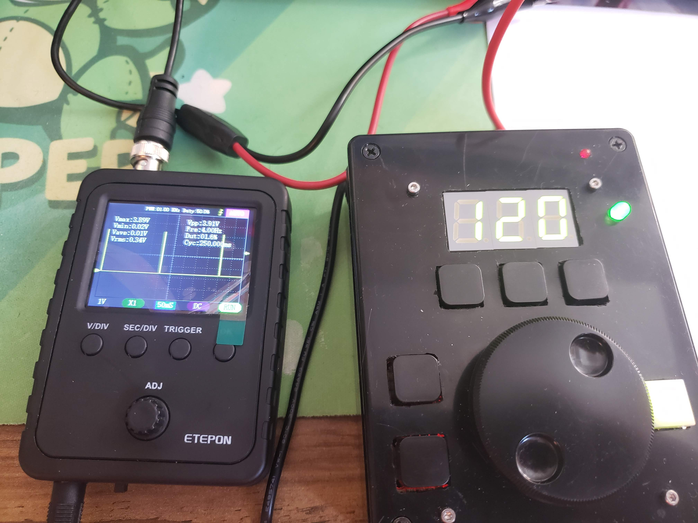
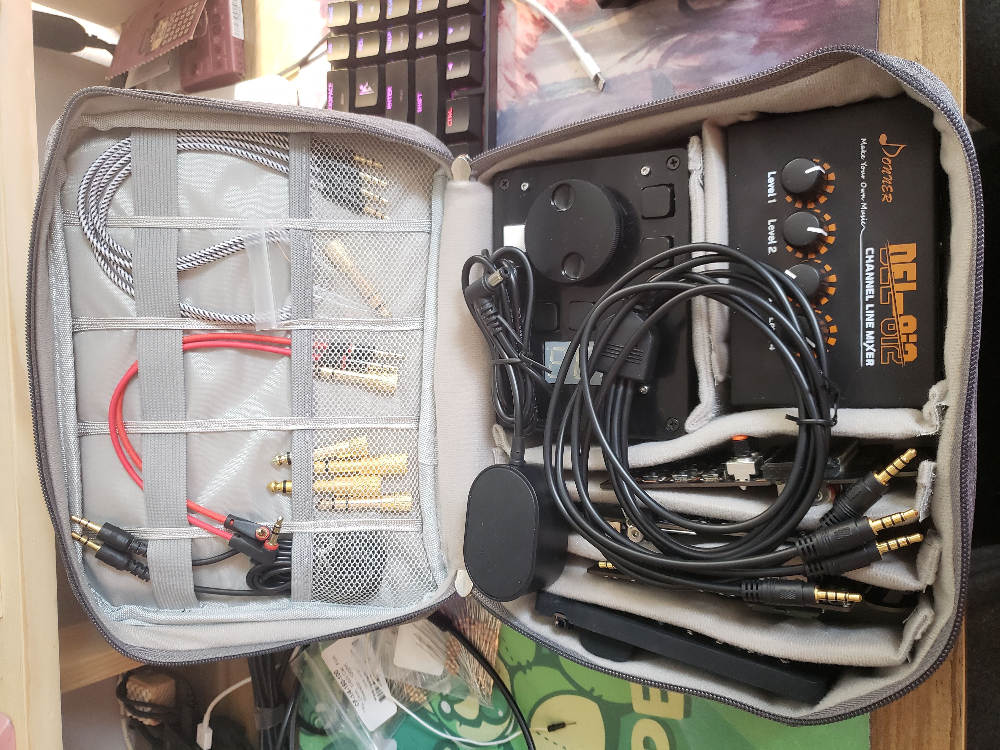
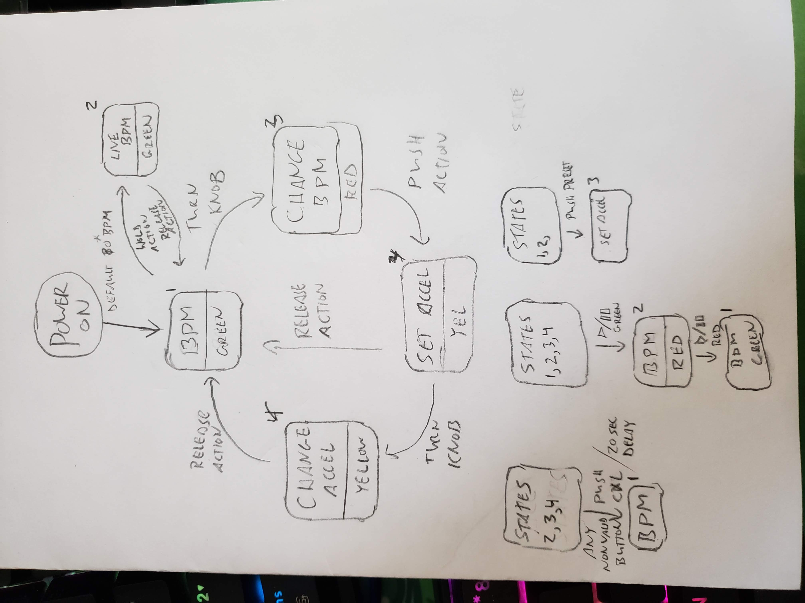
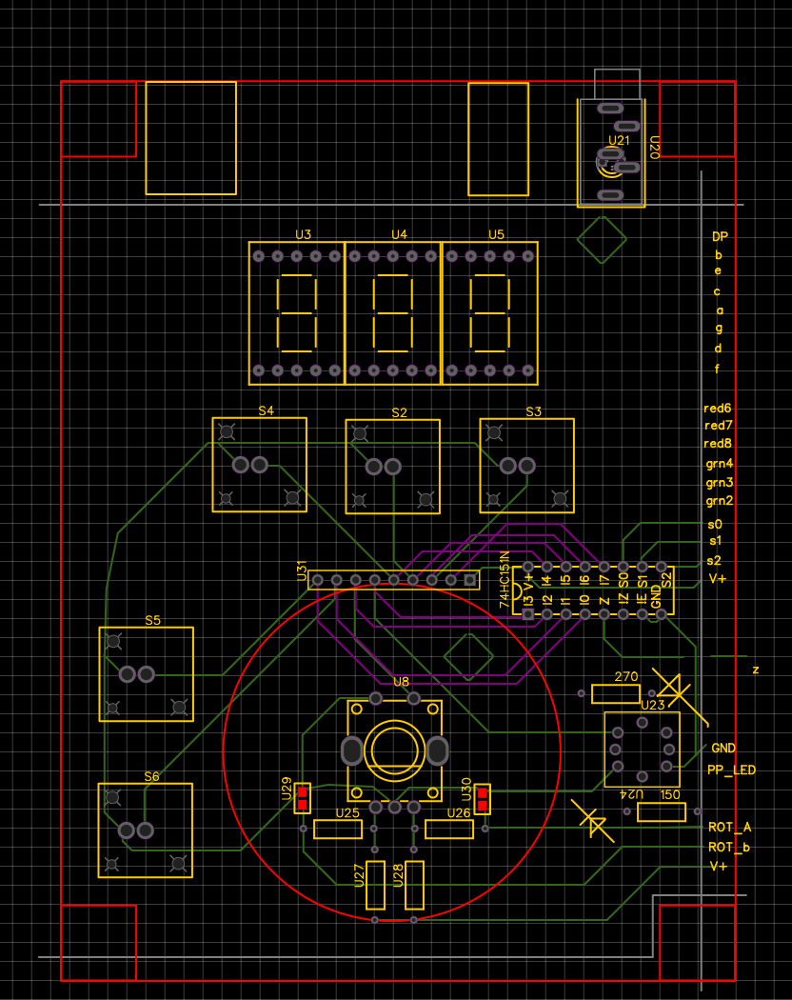
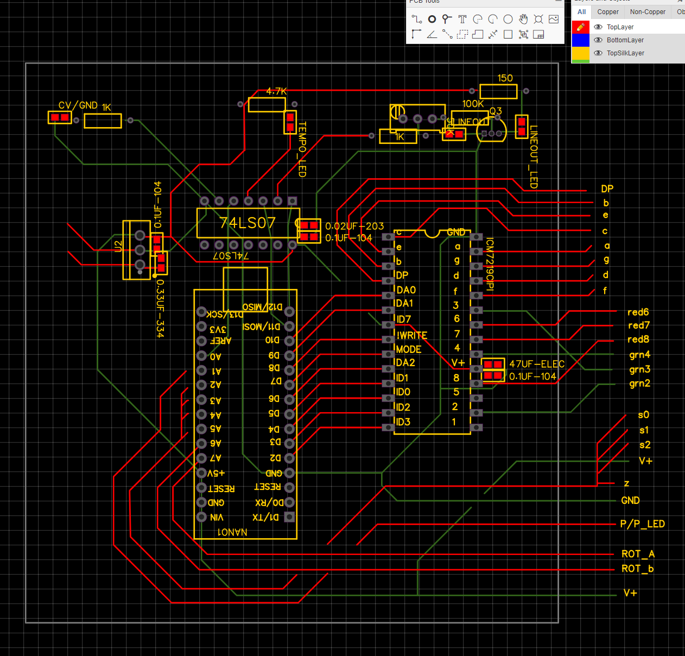
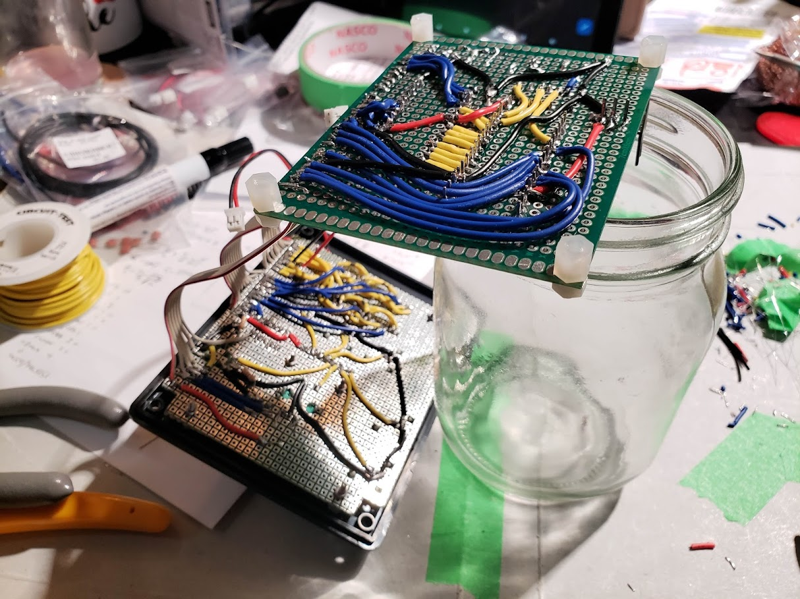
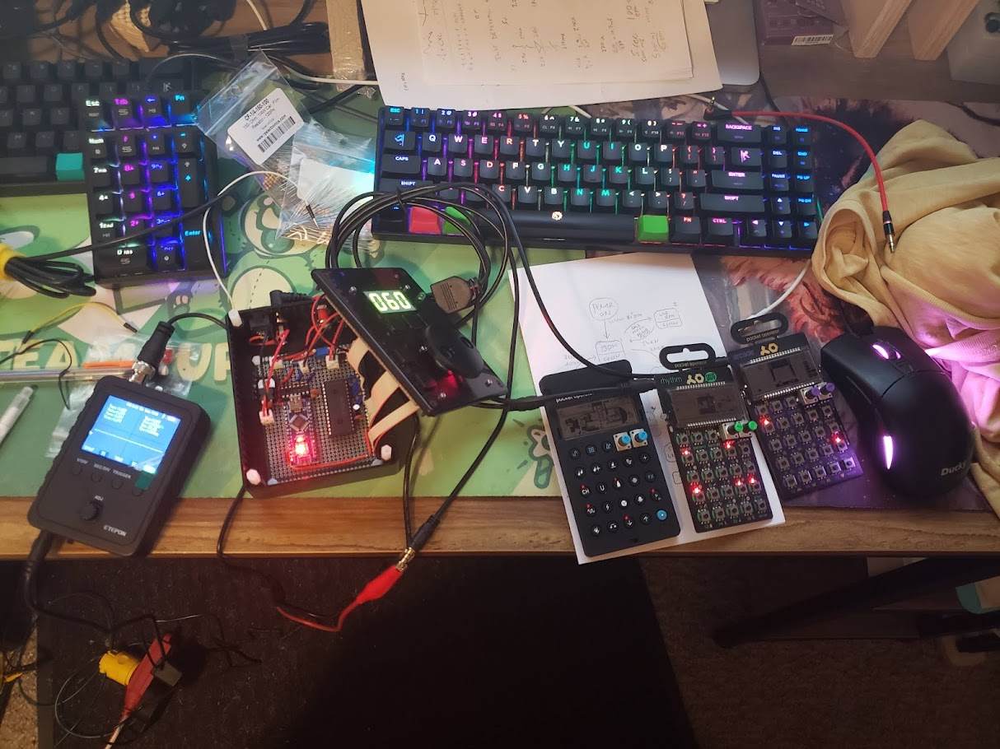

# Arduino PO Beatbox
by Tim Schmidt

<!DOCTYPE html>
  <table>
    <tr>
      <td>
        
      </td>
      <td>
        
      </td>
      <td>
        
      </td>
    </tr>
  </table>
</html>


This project aims to address the challenge of daisy-chaining multiple Teenage Engineering Pocket Operators, which often results in dependent volume and signal levels from one unit to the next. To tackle this issue, the Arduino PO Beatbox offers a solution: it can send a synchronization pulse in parallel to all units and then mix them together, providing individual control over the signal output to the amplifier.

One significant contribution made during this project was the development of a chip driver for the ICM7218C LED Driver, which did not exist in the Arduino module library previously. The ICM7218C LED Driver is crucial for the functioning of this project, enabling synchronized visual feedback for the Pocket Operators.

## ICM7218C LED Driver Library
You can find the ICM7218C LED Driver library I produced here: [ICM7218C LED Driver Library](https://github.com/tttmmmsss/ICM7218C)

## Project Images
- ICM7218C Specification 
- PEC12R Placement 
- Daughterboard 
- Mainboard 
- Work in Progress 1 
- Work in Progress 2 

## Arduino Code
The Arduino sketch for the Arduino PO Beatbox can be found in the "beatbox_fullhardware.ino" file.

## Video Demonstrations
- Feature Demo: [Watch the Feature Demo](https://youtu.be/wUSr6W50LJI)
- Tuning Output Voltage: [Tuning Output Voltage Video](https://youtu.be/fswCqiL28x0)

---

Please refer to the [Google Photos Album](https://photos.app.goo.gl/SWdQEVwYZYm3CNe89) for additional media.
```

